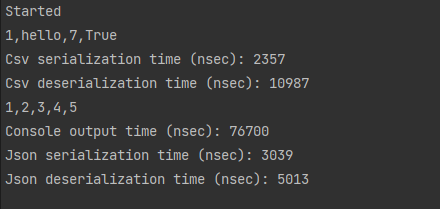

## Отражение (Reflection)
###### Вебинар от 12.09.23

### Домашнее задание
Рефлексия и её применение

**Цель**:  
Написать свой класс-сериализатор данных любого типа в формат CSV, сравнение его быстродействия с типовыми механизмами серализации.  
Полезно для изучения возможностей Reflection, а может и для применения данного класса в будущем.

**Описание/Пошаговая инструкция выполнения домашнего задания**:  
Основное задание:

1. Написать сериализацию свойств или полей класса в строку
2. Проверить на классе: class F { int i1, i2, i3, i4, i5; Get() => new F(){ i1 = 1, i2 = 2, i3 = 3, i4 = 4, i5 = 5 }; }
3. Замерить время до и после вызова функции (для большей точности можно сериализацию сделать в цикле 100-100000 раз)
4. Вывести в консоль полученную строку и разницу времен
5. Отправить в чат полученное время с указанием среды разработки и количества итераций
6. Замерить время еще раз и вывести в консоль сколько потребовалось времени на вывод текста в консоль
7. ровести сериализацию с помощью каких-нибудь стандартных механизмов (например в JSON)
8. И тоже посчитать время и прислать результат сравнения
9. Написать десериализацию/загрузку данных из строки (ini/csv-файла) в экземпляр любого класса
10. Замерить время на десериализацию
11. Общий результат прислать в чат с преподавателем в системе в таком виде:  
Сериализуемый класс: class F { int i1, i2, i3, i4, i5;}  
код сериализации-десериализации: ...  
количество замеров: 1000 итераций  
мой рефлекшен:  
Время на сериализацию = 100 мс  
Время на десериализацию = 100 мс  
стандартный механизм (NewtonsoftJson):  
Время на сериализацию = 100 мс  
Время на десериализацию = 100 мс  

### Инструкция запуска

1. Склонируйте приложение и зайдите в проект:  
   `git clone https://github.com/antoha-p/otus-hw5-12.09.23.git && cd otus-hw5-12.09.23`
2. Откройте решение и запустите проект:

